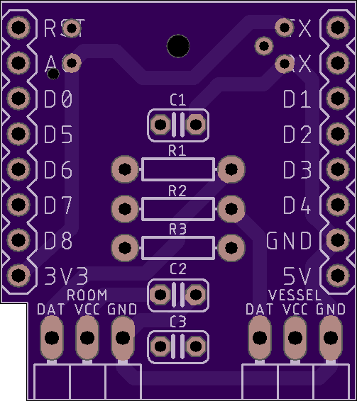
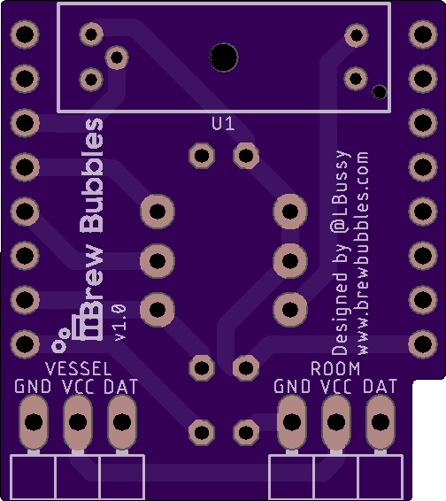
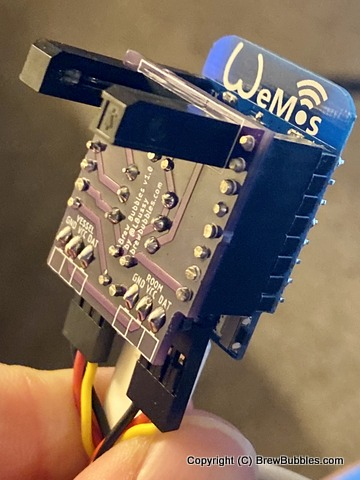
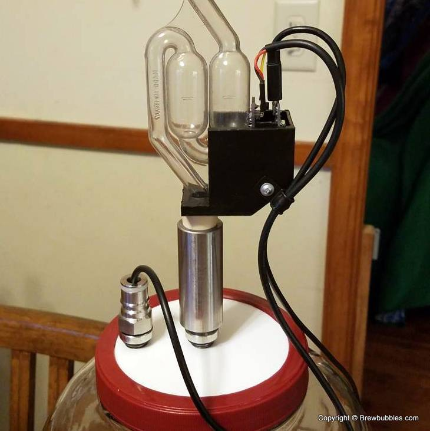

Device Assembly
========================================

Brew Bubbles runs on an ESP8266 controller. In order to detect the information to be logged, certain devices need to be connected to the controller.  A circuit board design, sometimes called a "shield" is provided to make this easier.

Assembly is not difficult, but it does require some basic soldering.

Materials Required
----------------------------------------

Since this uses 1 or 2 each of very common, very inexpensive components, you may find you are better off buying a resistor assortment for instance or buying 10 or 20 of a piece at a time for a nominal cost. Make several!

Gather the following parts and pieces:

Controller
``````````

The ESP8266 controller is paired with many different "developer boards" to make connections easier.  Do yourself a favor and do not buy a bare ESP8266 chip.  I can't help you if you do.

The combo used in this project is the **Wemos D1 Mini**.  Wherever you get it, make sure it is an ESP-12F (if that information is listed) and that it says 4MB (or sometimes shown as 32Mb which is 4 megaBYTES converted to megaBITS.)  Also, be sure it comes with the 8-pin male and female headers or else you will need to get them elsewhere.  You can find the Wemos D1 Mini in many places, here are a few:

1.  **The "Legitimate" Way**:  The Wemos D1 Mini has been knocked off mercilessly.  This is ironic since Esspressif makes the ESP8266 controller itself and they are a Chinese company.  In the past, wemos.cc_ was the way to buy the "original" Wemos D1 Mini, however, they no longer appear to sell them and instead the website is a wiki-type information source.

2.  **The Quick Way**:  Why, Amazon of course.  You can search for "Wemos D1 Mini" (it has to be "mini" and not "pro") and find a large number of different ways to buy.  My preference is to get a handful at a time since they are cheaper that way.  This_ link will get you five for $17.99 in a couple of days with free Prime shipping ($3.60/ea.)

3.  **The Cheap Way**:  AliExpress_ has everything anyone would ever need, so long as that person can wait a month or more for delivery.  For $1.99 each this is as cheap as it gets.  Be aware that there are different sellers on there and each will ship separately.  Sometimes it's better if you are buying multiple things to spend a little more just to get everything from one seller and save on shipping.

Printed Circuit Board
`````````````````````

The pcb_ directory in the repository_ contains the Eagle files for printed circuit board shield supporting Brew Bubbles.  The shield provides the necessary component connections and circuitry for the ESP8266 controller used in this project. It is nearly identical in size to the Wemos D1 mini we use to provide a very compact and lightweight footprint.  Order boards for $4.55 per set of 4 from PCBs.io using this link_, or download the Brew-Bubbles.brd file and use it with the board fabrication house of your choosing.



   This is a view of the top of the printed circuit board, as rendered by PBCs.io.



   This is a view of the bottom of the printed circuit board, as rendered by PCBs.io.

If you would like to personalize these board designs, you may modify them with Autodesk's EAGLE_. EAGLE is a scriptable electronic design automation (EDA) application with schematic capture, printed circuit board (PCB) layout, auto-router, and computer-aided manufacturing (CAM) features. EAGLE stands for Easily Applicable Graphical Layout Editor and is developed by CadSoft Computer GmbH.

General Parts
`````````````

These are the parts which you can get pretty much anywhere.

The items marked with an \*asterisk below are optional. They are in the design to provide a means to monitor and trend the ambient temperature where the fermenter is placed, and/or the fermenting liquid's temperature via a thermowell or insulated in contact with the fermenter. If you choose not to use these, the firmware will automatically skip reporting these readings.

=====  ======================================  ==========
Quan   Description                             Placement
=====  ======================================  ==========
3      0.1uF 10V Ceramic Capacitor             C1, C2, C3
2*     2.2k ohm 1/4W 5% Axial resistor         R1, R2
1      150 ohm 1/4W 5% Axial resistor          R3
2*     3-Pin 90-degree Header                  VESSEL, ROOM
1      GP1A57HR Transmissive Photointerrupter  U1
=====  ======================================  ==========

This BOM is available on Mouser_.  You can find these parts just about any of the usual places.  Make sure they are the proper rating and/or form factor.

If you choose to use the temperature sensors, you will need to obtain two (2) Waterproof DS18B20_ Temperature Sensor with lead.  These are the same as used with the various fermenter temperature control projects such as BrewPi Remix.  You will also need to crimp on a three-terminal female plug.  You can get a kit_ on Amazon with more terminals than you will ever need and the crimping tool for about $25, or do some careful AliExpress shopping.

Component Installation
----------------------

You are going to have to solder.  If you have legitimately never soldered anything before, I recommend you go spend a few minutes on YouTube and watch a few videos.  It is not hard at all once you get the hang of it.  And, while the shield is comparatively small, the components chosen are simple through-hole parts which may be easily soldered by a beginner with a little patience.

I will not give a step-by-step on how to solder here, but I will recommend the following part installation order for ease of assembly:

1.  Resistors - As the shortest mounted components, soldering the three resistors to the board first will be easiest. They are also some of the most tolerant components so these will give you some experience to get you going.

2.  3-Pin headers - These components are not sensitive to the heat at all except for the plastic.

3.  Capacitors - These are mounted next. Be sure to get them as close to the board as possible as having them stick up will change their intended impact on the circuit.

4.  8-pin female headers - These are the tallest items on the front side of the board and will be the last pieces to go on this side. Lightly tack on one pin and make sure the header is straight. When you have it positioned correctly, start from the other end and solder the pins properly. If you have a D1 laying around with the pin headers soldered on it already, using that to steady the parts will help. This is a chicken or the egg choice with #5. The first part, either the controller or shield, will be the most difficult. After that, you can use a completed "opposite" to steady the headers of the first. If you have a breadboard, that may also be used to steady the parts.

5.  8-pin male headers - These need to be soldered on the controller board. See note on #4 above.

6.  GP1A57HR photo-interrupter - If the controller is still attached, take it off temporarily. The photo-interrupter goes on the *back* side of the circuit board in the outline provided, therefore you solder it from the top side.  If you put it on the wrong side you can remove the solder (more YouTube work) but I'm not going to lie: it is frustrating.

Once you have finished soldering the shield, make sure to clean off the flux. You can use cheap vodka or Everclear, or a commercially available flux solvent.

It should be painfully obvious by now that the Wemos should plug into the shield.  There is a notch in the shield which should correspond to the notch in the Wemos, and the controller should be on the same side as the components as shown:



Bracket and Mounting
--------------------

The photo-receptor is positioned such that the gap surrounds the bottom of a fermentation S-Lock. In this way when bubbles pass by they are registered and counted.

.. figure:: sensor-bend.jpg
   :scale: 45 %
   :align: center
   :alt: Position of sensor around airlock

You should certainly feel free to use duct tape or a rubber-band or whatever suits you.  For those who desire a more finished approach, a 3-D printable bracket_ model is included in the project.  The finished device is slid into the top so that the temperature sensor connectors are exposed on the top.  The airlock is then passed through the hole and into the carboy stopper.  The hole may need to be adjusted larger or drilled out depending on the size of your airlock. If it is too loose around the airlock, a drill stop or even tape may be used on the tube under the bracket to hold it in place.

There is a hole in the side intended to allow using a pop-rivet or small screw to secure the temperature sensor cable(s) with an R-type cable clamp_. This is recommended to avoid strain on the small wires.




.. _wemos.cc: https://www.wemos.cc/en/latest/index.html
.. _This: https://www.amazon.com/IZOKEE-NodeMcu-Internet-Development-Compatible/dp/B076F52NQD/
.. _AliExpress: https://www.aliexpress.com/item/32688079351.html
.. _pcb: https://github.com/lbussy/brew-bubbles/tree/master/pcb
.. _repository: https://github.com/lbussy/brew-bubbles/
.. _link: https://pcbs.io/share/4lgy0
.. _EAGLE: https://www.autodesk.com/products/eagle/overview
.. _Mouser: https://www.mouser.com/ProjectManager/ProjectDetail.aspx?AccessID=216fcbe935
.. _DS18B20: https://www.amazon.com/Vktech-Waterproof-Digital-Temperature-DS18b20/dp/B00EU70ZL8/
.. _kit: https://www.amazon.com/MG-SN-28B-Ratchet-Wire-Crimper/dp/B07FCX1M6Q/
.. _bracket: https://github.com/lbussy/brew-bubbles/tree/master/bracket
.. _clamp: https://www.amazon.com/InstallerParts-Pack-R-Type-Cable-Clamp/dp/B01DEX6J4U
