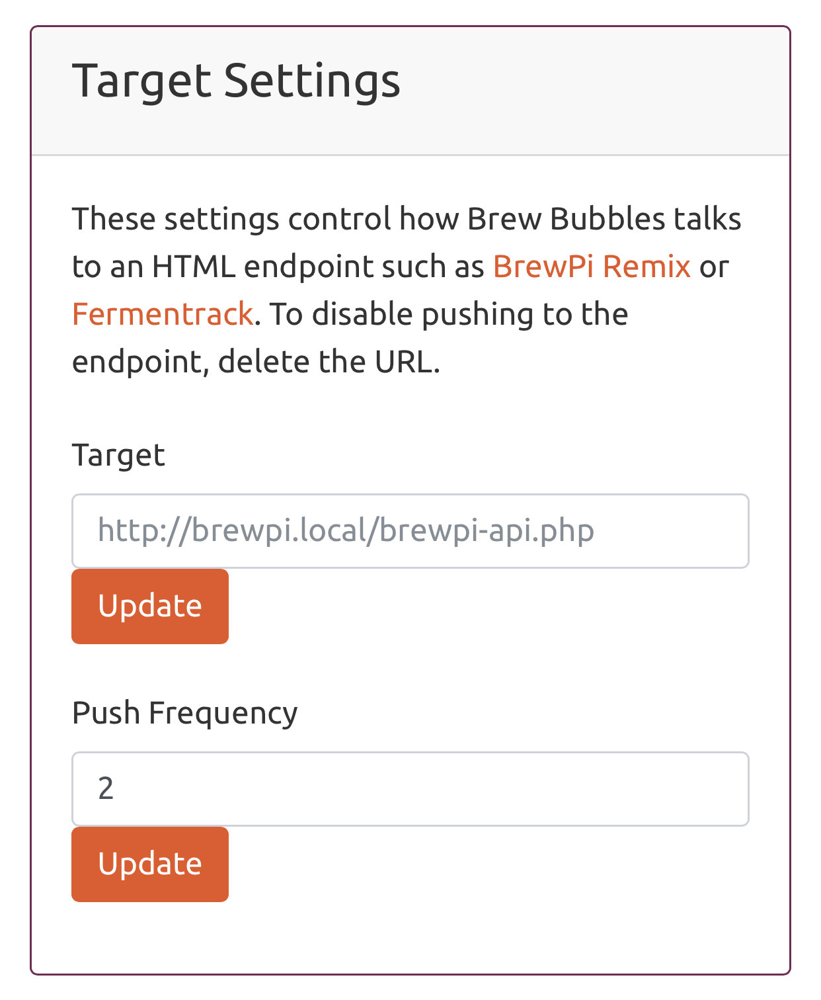

Operation and Configuration
===========================

Brew Bubbles is presented to the user for monitoring and configuration as a set of web pages.  Below I will present the different information and settings available.

mDNS Support for Client OS
--------------------------

The Brew Bubbles device leverages multicast Domain Naming System (mDNS) to make it easier to connect to your device.  You may also have heard of zeroconf which includes mDNS, or Avahi which is a different implementation of mDNS.  For our purposes, all of them will work together.

Since Brew Bubbles is intended to be accessed and configured via web page, you need to know its address.  Your local WiFi will automatically assign an IP address if you have not entered a static address.  You can always type in somethign like `192.168.4.100` but that's not as easy to remember as `brewbubbles.local`.

MacOS and Linus (including Raspberri Pi's) have implementationso of mDNS which will natively allow them to use the *.local name.  Windows requires a small program to be installed to support mDNS.  Support for mDNS is indicate in the table below:

================  ============================================================
Operating System  mDNS Support
================  ============================================================
MacOS             Built-in
iOS               Built-in
Linux             Built-in most versions; If not, install Avahi
Android           Not natively supported.  No Android for testing.
Windows           Not natively supported.  Install Bonjour_ from Apple
================  ============================================================

You can certainly work with Brew Bubbles without mDNS, however it will make your life easier.  If you do not implement mDNS of course you will either need to use an OS hosts_ file, or bookmark (or remember) the IP address.

Once you have your chosen method decide upon, access Brew Bubbles by using the name `brewbubbles.local` or the configured IP address in your chose browser.


Menu
----

Across the top of every page, a menu is displayed.  The standard desktop page looks like the below:


The mobile header looks like the below:

.. figure:: mobile_header.jpg
   :scale: 45 %
   :align: center
   :alt: Mobile menu view

Clicking on the three vertically stacked lines, called a "triple bar", will drop down the main menu:


The page layout is responsive, the header type is actually tied to the display ratio.  If on a desktop you change your browser window layout to be more narrow, the mobile header will be displayed.

Either across the top in desktop mode, or as a drop-down when you click the &equiv; character, you will see the following choices:

Home
    The main page, displaying the current readings.

Settings
    Configuration and maintenance choices.

Help
    Information about where to get help.

About
    Information about the author.

Each of these is described below.

Home Page
---------

Accessing the main page of Brew Bubbles provides you with ready access to all functional monitoring points:


The following items are shown:

Vessel Name
    This is a name which you may assign to help you keep track of multiple devices.  It defaults to "Fermenter 1" but may be changed in the settings.

Bubbles per Minute
    Brew Bubbles internally polls the device for approximately one minute.  It then reports the bubbles per minute in exact terms, meaning the number may be a decimal.  Brew Bubbles will also use a sliding window to average the readings in order to help filter noise.  The sliding window is set at 15, meaning as the device is in operation it will report Bubbles per Minute as an average of up to the last 15 readings.  In effect this is a 15 minute average.  This window is not configureable via the interface.

Ambient Temp
    If you have an ambient (room) temperature sensor installed, this will report the temperature in the configured temperature format (default is Farenheit.)  This temperature is reported in a 5-minute sliding window.  This window is not configurable via the interface.

Vessel Temp
    If you have a vessel temperature sensor installed, this will report the temperature in the configured temperature format (default is Farenheit.)  This temperature is reported in a 5-minute sliding window.  This window is not configurable via the interface.

Last Reading
    Last reading is the date and time of the last calculated reading set.  Internally the device refreshes its values every 60 seconds (approximately.)

Refresh In
    The web page refreshes its displayed values every 60 seconds.  This field shows the time remaining until that refrersh.

.. _Bonjour: https://support.apple.com/downloads/bonjour_for_windows
.. _hosts: https://en.wikipedia.org/wiki/Hosts_(file)

Settings Page
-------------

The settings page contains all configurable items for configuration and control of Brew Bubbles.

Note:
    Each setting has an "Update" button to save that individual setting.  Make sure you save each setting as you go.  If you change two settings and click "Update", only the setting corresponding to the update button will be saved.

Controller Settings
```````````````````

The first settings frame is Controller Settings.  This deals with overall device configuration.


Two items may be configured here:

mDNS ID:
    The default mDNS name for Brew Bubbles is `brewbubbles`.  This name forms the name portion of the mDNS name `brewbubbles.local`.  The mDNS name needs to be unique on the local network.  If you hae more than one Brew Bubbles, you should change these names to be unique.  Should you forget and have two with the same name, you will have to access the controller via the IP address to change the name.

    The name should be 3 to 24 characters in length, begin with a letter, and contain only ASCII letters 'a' through 'z' (case-insensitive), the digits '0' through '9' and the hyphen-minus character ('-').  Do not include the `.local` portion of the name.

Bubble ID:
    This is an additional field which can be used to profide distinction between different Brew Bubbles devices reporting to a common system.

Temperature Settings
````````````````````

Temperature format and calibration is configured in this section:


Temperature Format:
    Select either Farenheit or Celsius with the radio button and click "Update."  Conversion will happen internal to the controller and be displayed in the proper format.

Temperature Calibration:
    In this section you may enter calibration offsets to either sensor independantly.  Enter any decimal-based number from -25.0 to 25.0 and clicj "Update."  The offset will be applied internally and the corrected temperatures will be displayed.

Target Settings
```````````````
Target settings control how Brew Bubbles reports to HTML endpoints such as BrewPi Remix or Fermentrack.  BrewPi Remix will automatically begin to report on Brew Bubbles data once received at its endpoint.



Target:
    This may be any DNS or mDNS name.  If you are using mDNS, be sure to include the ".local" portion.  This should be a complete URI, including target page and port if needed.  For BrewPi Remix, the name will be `http://{hostname}.local/brewpi-api.php`.  Rememver to click "Update" after entering the target URL.
    
    Only http (not https) is supported.  Support for SSL on controllers is extremely resource intensive as well as fairly unstable at this time.  If the libraries improve in the future, https support will be consideered.
    
    If a port number is required, it comes immediately after the host name.  Basic URI rules are:

```
http:[//authority]/path[?query][#fragment]
```

Authority is made up of:

```
authority = [userinfo@]host[:port]
```

For more information, please review the Wiki_ article.

.. _Wiki: https://en.wikipedia.org/wiki/Uniform_Resource_Identifier

Push Frequency:
    Push frequency is entered in minutes.  Be sure to check the requirements and restrictions of your target system so that you do not flood the target.  BrewPi Remix for instance is recommended to be set at 2 minutes which matches the default charting granularity.  Valid settings for this field are 1 to 60 minutes.

Brewer's Friend Settings
````````````````````````

The nice folks at Brewer's Friend have added "BPM" (Bubbles per Minute) to their API.  Adding Brew Bubbles to your Fermentation Chart is done on the Fermentation Chart page for your brew under "Devices."  Select "Link Devices", choose a "Stream" device, and select your Bubble ID.  The device must have reported to Brewer's Friend at least once to be listed.


Brewer's Friend Key:
    Find your personal API key from your Profile dropdown in the top-right corner of the web page under "Integrations."  Towards the top of the page is a section labeled  "API Key."  Copy the API Key and enter it into this section and click "Update."  The key is a long hexidecimal key which will look like `c6e88f70f575c4ecdca3dcb686381185`.

Push Frequency:
    Push frequency is entered in minutes.  Brewer's Friend requires that you push readings no more than every 15 minutes.  Valid settings for this field are 15 to 120 minutes.

Other
`````

Firmware Update and WiFi reset are covered in subsequent sections.
