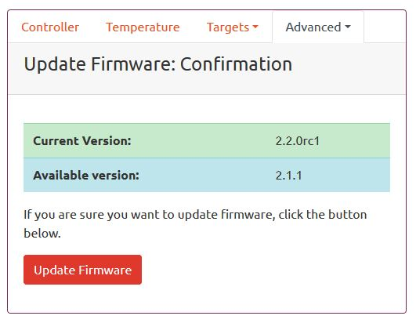

Firmware Update
===============

After you initially flash the controller, you may update Brew Bubbles via the web page when new versions are released.  You may do this without erasing any of the Brew Bubbles' settings.  If you instead choose to flash new firmware and SPIFFS manually, your application configuration is lost.  Click the "Update Firmware" button to continue.

.. figure:: 1_update_firmware.jpg
   :scale: 45 %
   :align: center
   :alt: Update Firmware

The next page displays your controller's current version, as well as the latest version available.

If you wish to proceed, clicking "Update Firmware" one more time begins the process.

A page displays while the upgrade is in progress.

Warning:
    Do not close this page.  If you close the page before the update is complete, you may lose your application settings.

During this process, both the firmware and the SPIFFS updates apply.  When the update is complete, the application settings are re-applied, and a completion message is displayed.

The controller's onboard LED may flicker during the upgrade.  Once complete, the LED remains steady on or off, depending on whether the sensor is blocked.

.. figure:: 4_update_firmware.jpg
   :scale: 45 %
   :align: center
   :alt: Update complete

The page redirects after this message and opens the main page, or you may navigate there manually.
