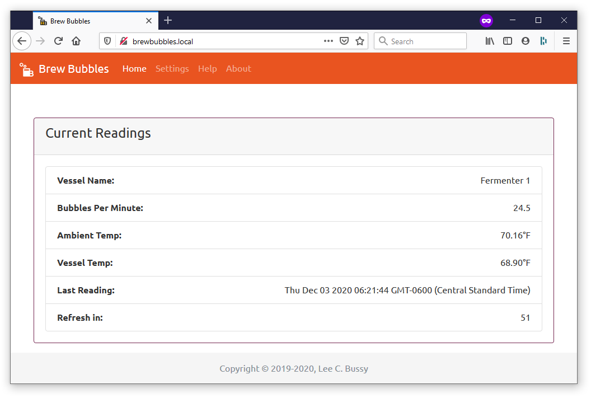

Brew Bubbles Documentation
==========================

One of the very first things a homebrewer does in the morning after a brew day is rush to the fermenter and look to see if the airlock is bubbling. Just in case you are not quite at the point you take a day off afterward, or even remember to brew on Saturday, this project is for you.

Brew Bubbles is a combination hardware/software solution for homebrewers. Brew Bubbles intends to monitor the fermentation process by counting and reporting bubbles in an S-type airlock as “Bubbles per Minute” (BPM.) Also, since not everyone has a fancy fermentation chamber and temperature control, Brew Bubbles optionally reports your fermenter’s temperature as well as that of which the room in which the fermenter rests. All of these reports in a compact mobile-responsive web page served by Brew Bubbles.

If you use temperature control already, such as BrewPi Remix or Fermentrack, Brew Bubbles reports that data to display in that solution. If you use a cloud dashboard for your brews, such as Brewer’s Friend, you can display the data there as well.

Contributions
-------------

Documentation should always be considered a work in progress; in that, I depend on *you* to help me make sure it is relevant and easy to read.  *I* know how to work with Brew Bubbles.  My goal is to make you an expert too.  Anything that is confusing is a bug, and I want to know about it, please.

For spelling/grammatical errors, or if you would like to improve the documentation, please feel free to issue a pull request with the update.  For technical issues with the documentation, please  `open an issue on GitHub`_.

Table of Contents
-----------------

.. toctree::
    :maxdepth: 2

    prerequisites/index.rst
    assembly/index.rst
    installation/index.rst
    setup/index.rst
    configuration/index.rst
    firmwareupdate/index.rst
    wifireset/index.rst
    api/index.rst
    troubleshooting/index.rst

.. _open an issue on GitHub: https://github.com/lbussy/brew-bubbles/issues
.. _BrewPi Remix: https://www.brewpiremix.com
.. _Fermentrack: https://www.fermentrack.com
