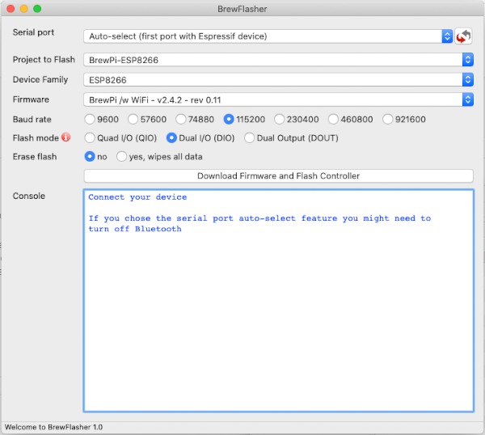

Installing the Firmware
=======================

There are two critical files in this project:

=============  ======================================  ==========
File           Description                             Address
=============  ======================================  ==========
firmware.bin_  The Brew Bubbles application layer      0x00000
littlefs.bin_    The Brew Bubbles web file system        0x300000
=============  ======================================  ==========

These files represent the program that you upload to your controller.  The `firmware.bin` file is the C-based program that handles serving web pages, processing configurations, detecting pulses (bubbles), scheduling, and monitoring the temperature.  The LittleFS file system is delivered within the `littlefs.bin` file.  LittleFS is analogous to a directory on your computer.  It contains web pages and images served via the web interface.

Flashing Firmware - Initial
---------------------------

Flashing the firmware may be done from many platforms with a variety of tools.  The following are some methods that have I have tested. Other methods may work; however, I have no experience with them.

Important Note:
    The ESP8266 has a memory section which is not erased or written over by flashing firmware. If you have previously used your controller for any other tasks, I recommend that you wipe the flash memory before you begin. The method to do that differs by the tool used, and more information follows in the sections below.

**Before proceeding, connect your controller via the USB port to your workstation.**

Preferred Method for Windows and Macs
`````````````````````````````````````

BrewFlasher_ is a stand-alone desktop application for Windows and macOS designed to simplify flashing Brew Bubbles (And other brewing-related firmware) to your controller.

It handles everything - locating the correct firmware, downloading it, setting the correct flash options/offsets, and flashing the firmware. There is no fumbling with the command line or worrying about esptool options. Select the project you want to flash, click a button, and you have finished.

You may download BrewFlasher_ from its GitHub release page or BrewFlasher.com_.



You will use the following settings:

- Serial port: Auto-select
- Project: Brew Bubbles
- Device Family: ESP8266
- Firmware: Brew Bubbles (latest version)
- Baud rate: 921600 (any should work, this is faster)
- Flash mode: Dual I/O (DIO)
- Erase flash: yes, wipes all data (this avoids problems later on - it will wipe wifi settings if any)

Now click the button that says, "Download Firmware and Flash Controller."

Here_ is a short video produced by the author of BrewFlasher.

Unix-Based Platforms (or Windows with Python)
`````````````````````````````````````````````

Espressif, the makers of the ESP8266, have adopted a python-based tool named esptool_.  Assuming you have either Python 2.7 or 3.4+ on your system, you can install *esptool* with *pip*:

::

    pip install esptool

**Note:** With some Python installations, you may receive an error.  Try `python -m pip install esptool` or `pip2 install esptool` (the latter, especially if you are on Python3).

After installing, esptool.py is available in the default Python executables directory.  For manual installation instructions, please visit the GitHub repository_.

Once *esptool* is installed, you may use the following command line to flash the firmware (assuming the firmware is in the local directory):

::

    esptool write_flash 0x00000 firmware.bin 0x300000 littlefs.bin

Please note that this takes advantage of *esptool*'s capability to auto-detect the controller attached via USB.  If you have other devices directly attached to your system, this may fail, and you will need to specify the port manually. For example: `-p /dev/ttyUSB0` (or `-p COM3` on Windows.)

If you desire to erase your controller, you may also use `esptool`'s erase flash option:
::

    esptool erase_flash

Mac Platforms
`````````````

I do not have access to a Mac. However, anecdotally, I believe Mac users may follow the "*Unix-Based Platforms*" instructions above.  If you have firsthand knowledge of this process, please let me know.

Windows-Based Platforms
```````````````````````
There are two methods for uploading the firmware files to your controller.  The preferred method is BrewFlasher; the controller vendor supplies another available way:

Espressif Tools
:::::::::::::::

Espressif's Flash Download tool is the tool that the makers of the ESP8266 have released.  Download_ it directly from Espressif's website.  Unzip the tool to a convenient folder and execute the application (named `flash_download_tools_v3.6.7.exe` at the time of writing.)

Here you see the console window and the main screen:

.. figure:: Splash.PNG
   :scale: 60%
   :align: center
   :alt: Splash screen for the Flash Download tool

Select "ESP8266 DownloadTool."  Setup as follows:

- Add the firmware file
  - Check the first checkbox
  - Click the ellipsis (...) next to the text field
  - Navigate to the firmware directory, select `firmware.bin` and click "*Open*"
  - In the right-most text field after the "*@*" symbol, enter the address `0x00000` (zero, the lower-case letter "X", followed by five zeros)
- Add the SPIFFS file
  - Check the second checkbox
  - Click the ellipsis (...) next to the text field
  - Navigate to the firmware directory, select `littlefs.bin` and click "*Open*"
  - In the right-most text field after the "*@*"* symbol, enter the address `0x300000` (zero, the lower-case letter "X", followed by the number "3" and five zeros)
- Set the CrystalFreq to `26M`
- Set the SPI Speed to `40MHz`
- Set the SPI MODE to `QIO` (you may use `DIO` if you experience issues flashing the firmware)
- Set the FLASH SIZE to `32Mbit-C1` (32 Megabits = 4 Megabytes)
- Select the proper COM port
- Set BAUD to `460800` (you may use a lower speed if you experience issues flashing the firmware)


When setup is complete, click on the "*START*" button underneath the green box.  The darker green box will move across the bottom of the window, and when complete, the bright green box changes to "*FINISH*".

.. figure:: Finish.PNG
   :scale: 100 %
   :align: center
   :alt: Completion screen for the Flash Download tool

At this point, you may close the tool and the selection screen, and proceed with setup.

Erase Flash
-----------

If you desire to erase your controller, you may leverage the "*ERASE*" button within the Flash Download tool.

Firmware Updates
----------------

The web application provides Over The Air (OTA) update functionality for upgrades.  Navigate to the *Settings* page and scroll down to the *Update Firmware* section.

.. _BrewFlasher: https://github.com/thorrak/brewflasher
.. _BrewFlasher.com: https://www.brewflasher.com/
.. _firmware.bin: https://github.com/lbussy/brew-bubbles/raw/master/firmware/firmware.bin
.. _littlefs.bin: https://github.com/lbussy/brew-bubbles/raw/master/firmware/littlefs.bin
.. _esptool: https://github.com/espressif/esptool
.. _repository: https://github.com/espressif/esptool
.. _download: https://www.espressif.com/en/support/download/other-tools
.. _Here: https://youtu.be/7KZiRoxn-z8
