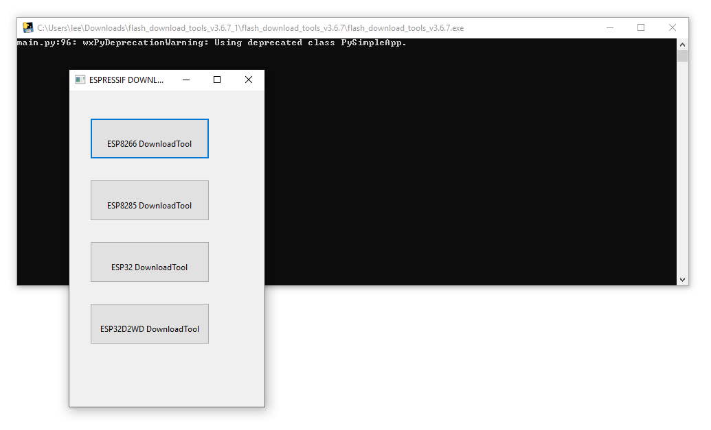
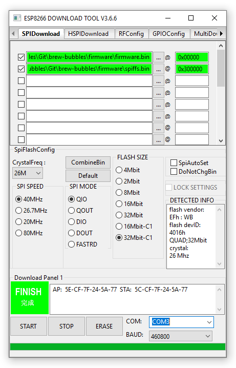

Installing the Firmware
=======================

There are two important files in this project:

=============  ======================================  ==========
File           Description                             Address
=============  ======================================  ==========
firmware.bin_  The Brew Bubbles application layer      0x00000
spiffs.bin_    The Brew Bubbles web file system        0x300000
=============  ======================================  ==========

Flashing Firmware - Initial
---------------------------

Flashing the firmware may be done from many platforms with a variety of tools.  The following are some methods that have been tested.  Other methods may work however I have no experience with them.

Before proceeding, connect your controller via the USB port to your workstation.

Important Note:
    The ESP8266 has a memory section which is not erased or written over by flashing firmware. If you have previously used your controller for any other tasks, it is recommended that you erase flash before you begin. The method to do that differs by tool, and is contained in the sections below.

Unix-Based Platforms (or Windows with Python)
``````````````````````````````````````````````````````

Espressif, the makers of the ESP8266, have adopted a python-based tool named esptool_.  Assuming you have either Python 2.7 or 3.4+ on your system, you can install *esptool* with *pip*: ::

    pip install esptool

**Note:** With some Python installations this may not work and you'll receive an error, try `python -m pip install esptool` or `pip2 install esptool` (the latter especially if you are on Python3).

After installing, you will have esptool.py installed into the default Python executables directory.  For manual installation instructions, please visit the GitHub repository_.

Once *esptool* is installed, you may use the following command line to flash the firmware (assuming the firmware is in the local directory): ::

    esptool write_flash -fm dio -fs 4MB-c1 0x00000 firmware.bin 0x300000 spiffs.bin

Please note that this takes advantage of *esptool*'s capability to auto-detect the controller attached via USB.  If you have other devices directly attached to your system this may fail and you will need to specify the port manually, for example: `-p /dev/ttyUSB0` (or `-p COM3` on Windows.)

If you desire to completely erase your controller, you may also use `esptool`'s erase flash option: ::

    esptool erase_flash

Mac Platforms
`````````````

I do not have access to a Mac, however, anecdotally I believe Mac users may follow the "*Unix-Based Platforms*" above.

Windows-Based Platforms
```````````````````````

Espressif's Flash Download tool is the recommended method for Windows platforms.  Download_ it directly from Espressif's website.  Unzip the tool to a convenient folder and execute the application (named `flash_download_tools_v3.6.7.exe` at the time of writing.)

You will see a console window and the main screen:



Select "ESP8266 DownloadTool."  Setup as follows:

- Add the firmware file
  - Check the first checkbox
  - Click the ellipsis (...) next to the text field
  - Navigate to the firmware directory, select `firmware.bin` and click "*Open*"
  - In the right-most text field after the "*@*" symbol, enter the address `0x00000` (zero, the lower-case letter "X", followed by five zeros)
- Add the SPIFFS file
  - Check the second checkbox
  - Click the ellipsis (...) next to the text field
  - Navigate to the firmware directory, select `spiffs.bin` and click "*Open*"
  - In the right-most text field after the "*@*"* symbol, enter the address `0x300000` (zero, the lower-case letter "X", followed by the number "3" and five zeros)
- CrystalFreq should be set to `26M`
- SPI Speed should be set to `40MHz`
- SPI MODE should be set to `QIO` (`DIO` may be used if you experience issues flashing the firmware)
- FLASH SIZE should be set to `32Mbit-C1` (32 Megabits = 4 Megabytes)
- Select the proper COM port
- Set BAUD to `460800` (a lower speed may be used if you experience issues flashing the firmware)

.. figure:: Setup.PNG
   :scale: 100 %
   :align: center
   :alt: Setup screen for the Flash Download tool

When setup is complete, click on the "*START*" button underneath the green box.  The darker green box will proceed across the bottom of the window, and when complete the bright green box will change to "*FINISH*".



At this point, you may close the tool as well as the selection screen, and proceed with setup.

Erase Flash
-----------

If you desire to completely erase your controller, you may leverage the "*ERASE*" button within the Flash Download tool.

Firmware Updates
----------------

The web application provides Over The Air (OTA) update functionality for upgrades.  Navigate to the *Settings* page and scroll down to the *Update Firmware* section.

.. _firmware.bin: https://github.com/lbussy/brew-bubbles/raw/master/firmware/firmware.bin
.. _spiffs.bin: https://github.com/lbussy/brew-bubbles/raw/master/firmware/spiffs.bin
.. _esptool: https://github.com/espressif/esptool
.. _repository: https://github.com/espressif/esptool
.. _download: https://www.espressif.com/en/support/download/other-tools
