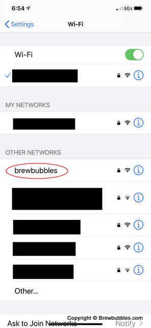
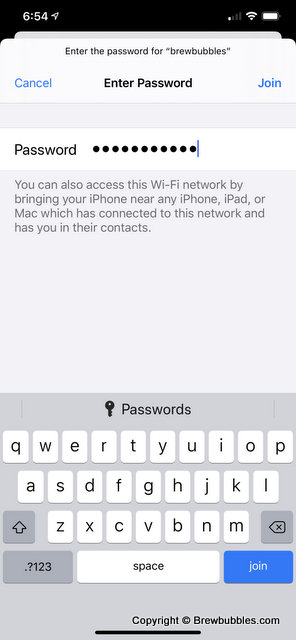

Set Up Networking
==========================

Once you have flashed the firmware and littlefs files to your controller, it starts in Access Point mode with a captive portal.   A captive portal is similar to what you get when you connect to free WiFi with a login web page.  Any network communication will be redirected to the portal page, allowing you to log in.  This captive portal is how you initially configure Brew Bubbles, allowing it to connect to your local WiFi.

This process works best through a phone in most cases.  There are some peculiarities in the ESP8266 libraries, which sometimes cause the process to act a little flakey.  It may not open the portal page, or not issue an IP address to your client.  In testing, these problems did not come up using a phone.  If you don't have a phone handy, it is possible to do this work with your computer. However, I point out some caveats below.

Blink Mode:
    The LED on the ESP8266 is an indicator of various modes during operation.  When in AP mode, the LED blinks on and off at 0.5Hz.  That is, it is on for a second and off for a second.  When in this mode, the access point shows up in the list of available access points on your client.

Connect to Captive Portal
-------------------------

Connect to the access point as follows:

Login:
    Access Point Name (SSID): `brewbubbles`
    
    Password: `brewbubbles`



See the documentation for your particular phone, device, or computer OS if you don't know how to access this list.



Select the Brew Bubbles access point and enter the password: "brewbubbles" (without the quotes:)

.. figure:: 3_wifi_selected.jpg
   :scale: 90 %
   :align: center
   :alt: Connected to soft AP

Once you are connected, depending on the platform you are working on, a web page should open, displaying the portal.  With iOS, this should happen automatically.  While testing on various PCs, this was not 100% successful.  I noted two issues:

Captive Portal Page does not Open
```````````````````````````````````

#. If your default web browser is not opening the portal page automatically, open the browser of your choice.  It is likely that, at this point, the captive portal displays correctly.
#. If the portal does not open automatically, a bar may appear at the top of your browser with a button indicating that the network login page needs to open.  Clicking this button should open the portal.
#. If the portal still does not open, enter the address "192.168.4.1" (without quotes) in the address bar. The Brew Bubbles controller uses this address in portal mode.

Connection Timed Out or Similar Errors
``````````````````````````````````````

If you cannot open the captive portal web page by following the above instructions, it is possible your connection may not have been issued an IP address.  Follow instructions for your particular platform to set the following parameters:

IP Configuration:
    IP Address:  192.168.4.2
    
    Subnet Mask: 255.255.255.0
    
    Gateway: 192.168.4.1

These methods should allow you to configure the portal.  If you still cannot connect to the portal, please try another system or method before logging an issue.

Portal Configuration
--------------------

When you access the captive portal, you have six choices:

#. Configure WiFi
#. Configure WiFi (No Scan)
#. Info
#. Erase
#. Restart
#. Exit

.. figure:: 4_captive_portal.jpg
   :scale: 90 %
   :align: center
   :alt: Captive portal choices

Select option 1, "Configure WiFi."  You see the following configuration screen:

.. figure:: 5_ select_ap.jpg
   :scale: 90 %
   :align: center
   :alt: Captive portal choices

Your access point should be visible in the list on top.  Selecting it populates the name in the SSID field below.  If your access point does not show up, you can re-scan or simply enter the AP name manually.  Note this name is case-sensitive.  Next, enter your access point password in the "Password" field.

If you need to use a static IP address, you must fill out the following fields:

#. Static IP
#. Static Gateway
#. Subnet
#. Static DNS

If you have questions about these fields, consult the documentation for your access point.  You need not fill out these fields to use an automatically assigned IP address, since you may access the device by its name once connected to WiFi.

Once you have filled out at least the SSID and Password, click on the "Save" button.

.. figure:: 6_save_ap.jpg
   :scale: 90 %
   :align: center
   :alt: Save WiFi configuration

The controller restarts at this point and connects to the wireless access point you have configured.
