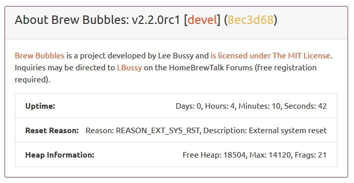

Troubleshooting
===============

The easiest way to get help with the project is to join the `Brew Bubbles discussion on Homebrewtalk.com`_.  You may also open an issue on Github_.

.. _Brew Bubbles discussion on Homebrewtalk.com: https://support.brewbubbles.com
.. _Github: https://github.com/lbussy/brew-bubbles/issues

This page includes various bits and pieces that do not fit elsewhere, which may help you if things are not going as expected.

.. contents::
    :depth: 3

LED Flashing
------------

In typical operation, the blue LED on the controller indicates the photo-receptor status.  The LED lights when the photo-receptor is not blocked (or when a bubble passes), and is dark when the photo-receptor is blocked (no bubble).

During non-operating mode, the LED flashes at different frequencies as an indicator of the process underway.

0.5Hz:
    The LED blinks at 0.5Hz or 1 second on, one second off when in Access Point mode

0.66Hz:
    The LED blinks at 1.5Hz (33 seconds on, .33 seconds off) while the controller attempts to connect to your WiFi.  After trying for 30 seconds, the connection attempt fails, and the controller enters AP mode.  AP mode times out after 120 seconds and resets the controller.

10Hz:
    The controller needs to access an Internet Network Time Protocol (NTP) server to set the correct time.  While attempting to get the time, the LED flashes at 10Hz or .05 seconds on, .05 seconds off.  Occasionally, the controller cannot get network time, in which case it remains in that loop indefinitely since the controller cannot operate without the correct time.  If you see this, you can reset the controller with the reset button located within the cutout and try again.

Double-Reset Detect
-------------------

If you need to access the AP configuration portal without resetting the WiFi settings via the web page, press the reset button twice within 10 seconds.  The controller resets and starts AP mode, where the LED flashes at 0.5Hz.  If the LED does not start flashing at the 0.5Hz rate, repeat the double reset until it does.  You need not treat the resets like a double-mouse click; once per second is usually sufficient.

Emergency AP mode
-----------------

If you cannot access the AP by any other means, you may do so by grounding D5 on the controller and resetting it via the reset button or with a power cycle.  The controller then starts in AP mode, where the LED flashes at 0.5Hz.

Serial Debug
------------

Serial debug has been left enabled in the firmware.  You may connect the device to your computer and use a terminal program set at a baud rate of 74880 to review the debug messages.  Rudimentary commands are allowed:

.. code-block::

    Available serial commands:
            p:      'Ping, e.g. {}' (null json)
            r:      Restart controller
            ?:      Help (this menu)

Telnet Debug
-------------

A simple Telnet server is available to connect with PuTTY or another terminal emulator over port 23.  There is no security to this connection; the connection will only emulate the serial connection display as if it was directly connected to your computer.  The same serial commands are available as described above.

Controller Reset
-----------------

You may perform a reset on the controller by navigating to Settings > Advanced > Reset.  The controller will reset as if you had pressed the reset button on the controller itself.

About page
-----------

The "About" page shows some diagnostic information which may be helpful in certain circumstances:

- **Header:** The header displays the firmware's tagged version, followed by the branch, followed by the commit.  This information may be helpful where confusion exists about which version is installed.
- **Uptime:** Uptime shows how long the controller has been running without a restart. The controller may reset itself for several reasons, including a 42-day reboot cycle.
- **Reset Reason:** The reason for the last reboot according to the core libs.
- **Heap Information:** Memory information for the controller.  Low memory conditions may cause crashes or occasionally self-reboots to attempt to heal the issue.

FAQ
---

No FAQ yet; I'll capture that as time goes on.
