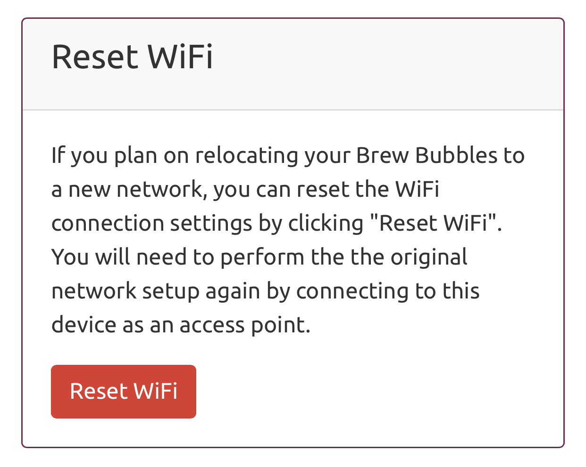
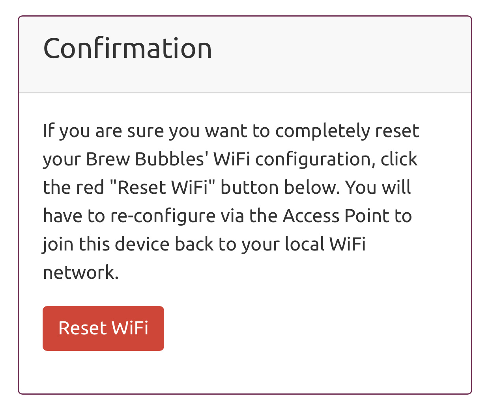
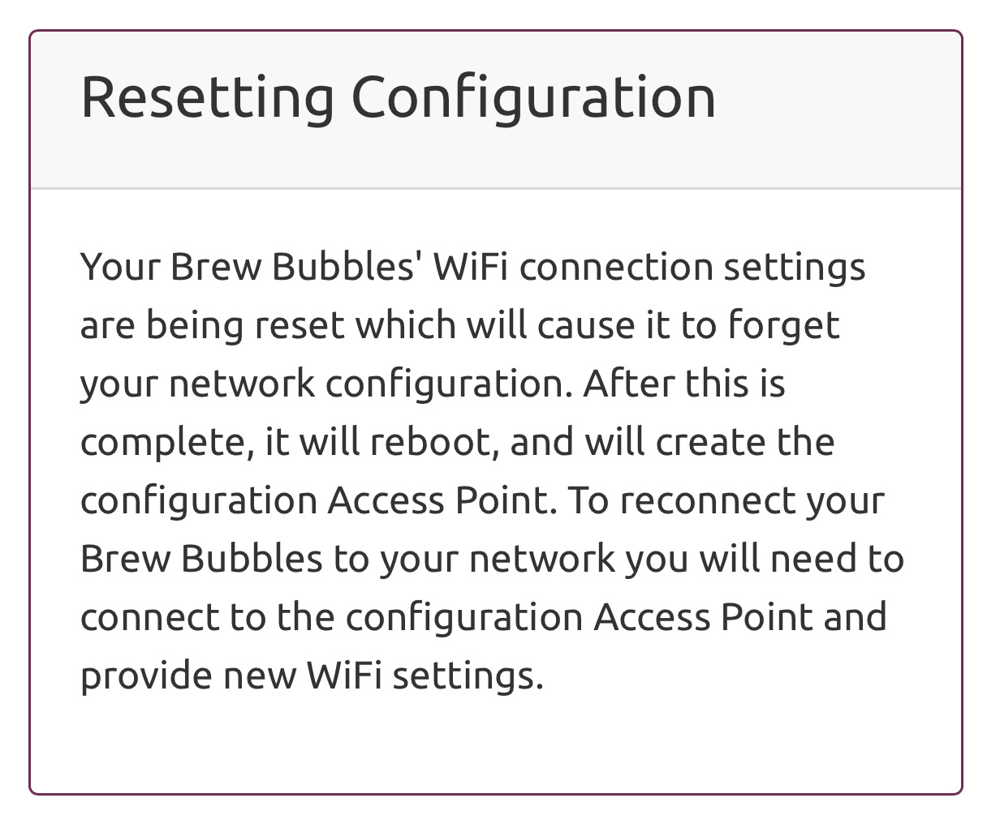

WiFi Reset
==========

I've provided the WiFi reset function to erase the WiFi settings from the controller in case you wish to move the device to a new network.

If you click the "Reset WiFi" button, the controller presents you with a confirmation page:

Clicking "Reset WiFi" again confirms the process.  You are presented with a page informing you that the settings have reset.

At this point, you are not able to control the device again until you configure the WiFi again.  The controller resets, and the Access Point activates where you may connect and configure the device via the captive portal.

Be aware that it is exceedingly easy to retrieve the WiFi password from the controller unless you erase it.  If you give a controller to another person (any controller, any application), be sure to erase the settings, or possibly the entire device.
