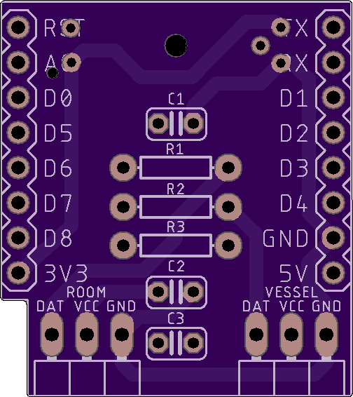

# Brew Bubbles Shield

This folder contains the Eagle files for printed circuit boards supporting [Brew Bubbles](https://www.brewbubbles.com/).

The shield provides the necessary component connections and circuitry for the ESP-8266 controller used in this project.  It is nearly identical in size to the Wemos D1 mini we use to provide a very compact and lightweight footprint.

| **Top** | **Bottom** |
|---|---|
|  |  |

## Ease of Manufacture

While the shield is comparatively small, the components chosen are simple through-hole parts which may be easily soldered by a beginner with a little patience.  I recommend the following order for ease of assembly:

1. Resistors - As the shortest mounted components, soldering the three resistors to the board first will be easiest.  They are also some of hte most tolerant components so these will give you some experience to get you going.
2. 3-Pin header - The second shortest component, this should go on next.  This component is not sensitive to the heat at all except for the plastic bar that holds it together.  
3. DS18B20 sensor - The temp sensor will go on next.  This piece is semi-sensitive to heat, so don't overdo it.  It is capable of withstanding a good amount of heat, but just be aware you can burn it out.
4. 8-pin female headers - These are the tallest items on the front side of the board and will be the last pieces to go on this side.  Lightly tack on one pin and make sure the header is straight.  When you have it positioned correctly, start from the other end and solder the pins properly.
5. 8-pin male headers - These need to be soldered on the controller board.  It is easiest to solder if you plug the pins into the female headers which are on the board at this point, and then place the controller over them.  This way you can be sure they are straight when you do your soldering.
5. GP1A57HR photointerrupter - If the controller is still plugged in, take it off temporarily.  The photointerrupter goes on the *back* side of the circuit board in the outline provided, therefore you solder it on the top side.

## Bill of Materials

Since this uses 1 or 2 each of very common, very inexpensive components, you may find you are better off buying a resistor assortment for instance or end up buying 10 or 20 at a time.  Make several!

| **Quan** | **Description** | **Placement** |
|---|---|---|
| 1 | 0.1μF 10V Ceramic Capacitor | C1 |
| 1 | 150Ω 1/4W 5%  Axial resistor | R1, R2 |
| *2 | 2.2kΩ 1/4W 5% Axial resistor | R3 |
| *2 | 3-Pin 90° Header | ROOM, VESSEL |
| 1 | Sharp GP1A57HR Transmissive Photointerrupter | U1 |
| 2 | 8-pin male stackable header (nearly always comes with the D1) |  |
| 2 | 8-pin female stackable header (nearly always comes with the D1) |  |
| 1 | Wemos D1 Mini R2 | U2 |
| *2 | Waterproof DS18B20 Temperature Sensor with lead | ROOM, VESSEL |

The items with an *asterisk are optional.  They are in the design to provide a means to monitor and trend one's ambient temperature where the fermenter is placed, and/or the fermenting liquid's temperature via a thermowell or insulated in contact with the fermenter.  If one chooses not to use these, the firmware will automatically skip reporting these readings.

Note that component labeled "ROOM" is an actual bare DS18B20 sensor, not a waterproof sensor on a lead as is common in brewing projects.  This is soldered directly to the board.  The second sensor intended to monitor the fermentation temperature is labelled "VESSEL" and *is* a typical waterproof sensor on a lead.

## Order Boards

Order 3 boards for $5.65 from [Oshpark using this link](https://oshpark.com/shared_projects/Ey5T84QR), or download the Brew-Bubbles.brd file and use it with the board fabrication house of your choosing.

## Modifying These Files
If you would like to personalize these board designs, you may modify them with [Autodesk's EAGLE](https://www.autodesk.com/products/eagle/overview). EAGLE is a scriptable electronic design automation (EDA) application with schematic capture, printed circuit board (PCB) layout, auto-router and computer-aided manufacturing (CAM) features. EAGLE stands for Easily Applicable Graphical Layout Editor and is developed by CadSoft Computer GmbH. The company was acquired by Autodesk Inc. in 2016.  

The program supports Windows, Linux, and Mac OS X.  EAGLE is available in a [free version](https://www.autodesk.com/products/eagle/free-download), as well as a [subscription-based version with more features](https://www.autodesk.com/products/eagle/compare).
